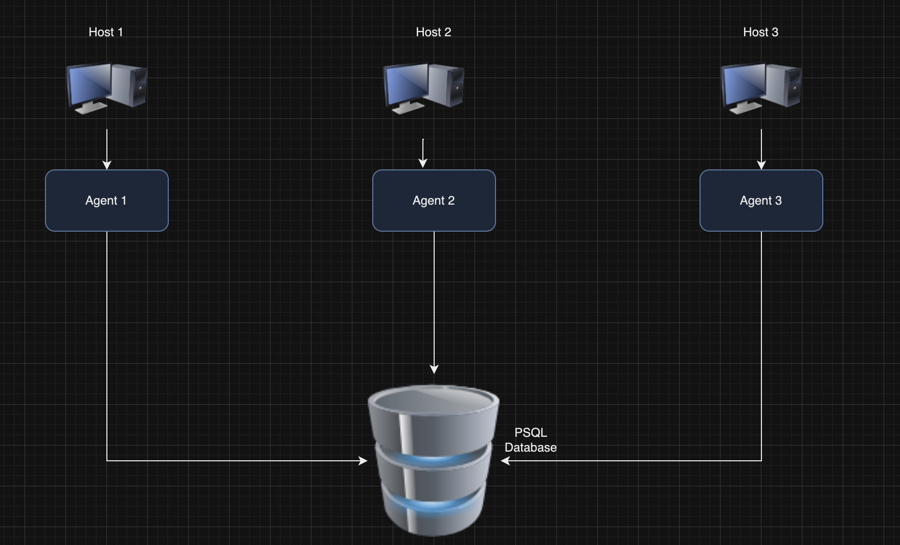

# Introduction
The main goal of this project is to create a monitoring agent on hardware usage data for better visibility on the efficiency of the Virtual Machine (VM), which can be used to save costs as running VMs via the cloud 
can get expensive. The users will be the technical team of Jarvis who want to find out how to save costs on running the VM. Real VNC Viewer was used for the VM and GCP for cloud storage. 
The data was retrieved using linux commands in the VM and bash scripts were used to parse and collect hardware info and computer hardware usage info
which was then stored in a psql database on a docker container every minute (only usage info stored every minute). Git was used for version control.

# Quick Start
- Start a psql instance using psql_docker.sh

```
./scripts/psql_docker.sh start
```

- Create tables using ddl.sql

```
psql -h localhost -U postgres -d host_agent -f ddl.sql
```

- Insert hardware specs data into the DB using host_info.sh

```
./scripts/host_info.sh psql_host psql_port db_name psql_user psql_password
```
	- Make sure to fill in the required fields
		ex: psql_host = localhost
				psql_port = 5432
				db_name = host_agent
				psql_user = postgres
				password = password
				
- Insert hardware usage data into the DB using host_usage.sh
```
./scripts/host_usage.sh psql_host psql_port db_name psql_user psql_password
```

- Crontab setup
### edit crontab file
	```
	crontab - e
	```
	### insert
		```
		* * * * * bash /home/centos/dev/jarvis_data_eng_Ayodele/linux_sql/scripts/host_usage.sh localhost 5432 host_agent postgres password > /tmp/host_usage.log
	  ```
### list crontab processes
	```
	contrab -l
	```
# Implemenation
To implement the project, a psql/docker container was created and started, docker volume: 'pgdata' was also
created for persistency. This would save the hardware data for monitoring in the case of a deleted container. The tables included, a host_info table: containing all the hardware
info for that specific machine and host_usage: a table monitoring the details of some key processes in the machine
(free memory, kernel space and status). These tables were stored in the database and crontab was used to get and 
insert updates into the host_usage table every 10 mins to keep track of any changes.

## Architecture
pwd: linux_sql

## Scripts
- psql_docker.sh
	pwd: linux_sql
	This script will start a container and volume if it doesn't exist and will initiate/end the psql docker container
	
	### To create the database
	```
	./scripts/psql_docker.sh create db_username db_password
	```
	### To start the docker container
	```
   scripts/psql_docker.sh start
    ```
	
    ### To stop the docker container
	```
	./scripts/psql_docker.sh stop
 	```

- host_info.sh:
	This script will input the hardware information into the host_info table
	```
	./scripts/host_info.sh psql_host psql_port db_name psql_user psql_password
	```
	
- host_usage.sh:
	This script will input the computer usage information into the host_info table
	```
	./scripts/host_usage.sh psql_host psql_port db_name psql_user psql_password
	```
- crontab:
	This script will automate the running of host_usage.sh every 1 minute
	store the code below in a text file, open using vim
	```
	* * * * * bash /home/centos/dev/jarvis_data_eng_Ayodele/linux_sql/scripts/host_usage.sh localhost 5432 host_agent postgres password > /tmp/host_usage.log
	```
	
- queries.sql:
	Insert hardware information and hardware usage information into the database and then
	pwd: linux_sql
	```
	psql -h localhost -U postgres -d host_agent -f sql/queries.sql
	```

## Database Modeling

- `host_info` 


| Field Name    | Description   | Type   | 
| ------------- | ------------- | ------ |
| id  | ID of entry  |  serial  |
| Hostname   | Hostname of computer  | variable size character |
| cpu_number | Number of cores on the computer  | integer|
| cpu_architecture | 32 or 64 bit  | variable size character|
| cpu_model | Model name  | variable size character|
| cpu_MHz | cpu clock speed  | float|
| l2 cache | Secondary cache  | int|
| timestamp | Time data was retrieved  | timestamp|
| total_mem | Total memory   | int |

A constraint was set on the id and hostname to be unique

- `host_usage`
This information specifically refers to the current hardware usage data and included the following fields:
timestamp, memory_free, cpu_idle, cpu_kernel, disk_io, disk_available

| Field Name    | Description   | Type   | 
| ------------- | ------------- | ------ |
| timestamp | Time data was retrieved  | timestamp|
| host_id  | ID of host_info entry  | serial |
| memory_free  | free memory available | integer |
| cpu_idle| time proess is not running | integer|
| cpu_kernel | 32 or 64 bit  | integer|
| disk_io | Model name  | integer|
| disk_available | cpu clock speed  |integer|

# Test
To test the DDL bash script, a query script was ran with sample insert values to populate the database.
It would populate the host_info and host_usage tables. 
Below is the command for the query script
```
psql -h localhost -U postgres -d host_agent -f sql/queries.sql
```

I also live tested the DDL script by inserting data for the host_usage and host_info table using the following commands

-- connect to the psql instance
```
psql -h localhost -U postgres -W
```
-- connect to the database;

```
psql -h localhost -U postgres -d host_agent -f sql/queries.sql
```

I also live tested the DDL script by inserting data for the host_usage and host_info table using the following commands

-- connect to the psql instance

```
psql -h localhost -U postgres -W
```

-- connect to the database;
```
postgres=# \c db_name; #ex:\c host_agent 
```

-- display host_info or host_usage table
```
postgres=# select * from host_info;
```

-- display host_usage table
```
postgres=# select * from host_usage;  
```


# Deployment
The database was instantiated on a docker container and persisted using a docker volume and crontab
was used to automate the retrieval of information on the usage data. The finished code was then pushed 
to GitHub for deployment

# Improvements
- Further improvements could be made on handling hardware updates
- Create visualizers for the data in the database to better conceptualize usage efficiency
- Set up alerts when certain metrics have exceeded a specified limit 

